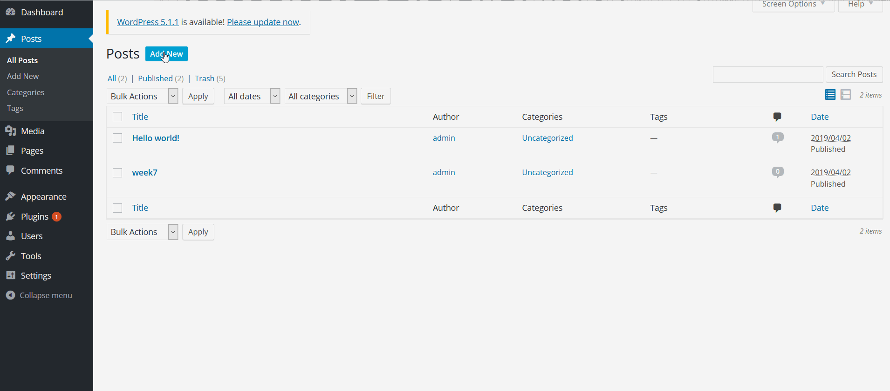

# CyberSecurity-Week7

1)(Required) Authenticated Stored Cross-Site Scripting (XSS) in YouTube URL Embeds

-Summary: While using the Youtube URL embed shortcode, we can insert a script inside the youtube url for an XSS attack. The reason why   this works is because the HTML sanitzation function ( wp_kses() ) does not look for escape sequences such as the ones used in the gif, "\x3c". 

-Vulnerability type: XSS
-Tested in version: 4.2
-Fixed in version: 4.2.13

-Steps to recreate:
   1) Go to the Posts tool in the toolbar and click on "Add New"
   2) Insert developed code attack as shown in the GIF
   3) Press "Update" then "View Post" 
   
-Affected source code: 
  [Link 1](https://core.trac.wordpress.org/changeset/40160/trunk/src/wp-includes/embed.php?old=38361&old_path=trunk%2Fsrc%2Fwp-includes%2Fembed.php)
  
  
2. (Required)  Legacy Theme Preview Cross-Site Scripting (XSS)

-Summary: This is caused due to a bug from a function (preview_theme()). If you are logged in as an administrator, you can visit one of the site's pages which use a few extra "$get" parameters that results in setting preview_theme_ob_filter as ob_Start callback function. As soon as ob_start() gets all of the pages content it will call preview_theme_ob_filter() to get all the HTML links. This removes the onlick=" event handler from the link tags.

-Vulnerability type: XSS
-Tested in version: 4.2
-Fixed in version: 4.2.4

